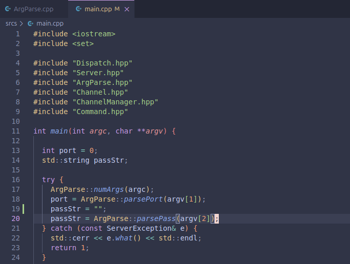

# ft_irc

`ft_irc` is a C++ school project that implements a small IRC server from scratch. IRC, or Internet Relay Chat, is an older but still influential chat protocol where users connect to a server, choose nicknames, join named channels, and send real-time messages to other users or groups.



This repository is not an IRC client. It is the server side: it accepts TCP connections, authenticates users with a password, tracks connected clients and channels, parses IRC commands, and sends protocol-style replies that can be understood by IRC clients such as `irssi`.

## Project Context

- School project: ecole 42 `ft_irc`
- Team size: 2
- Timeline: May 2024 to July 2024
- Duration: about 2 months
- Final grade: 115/100
- Bonus: some bonus functionality completed
- Language standard: C++98

At ecole 42, projects are evaluated with strict constraints. For this project, the important challenge is not using a prebuilt networking or IRC framework. The goal is to understand the protocol and build the server behavior directly with sockets, event polling, command parsing, and manual state management.

## What This Server Does

The server accepts multiple clients on a chosen port:

```sh
./ircserv <port> <password>
```

Example:

```sh
make
./ircserv 6667 secretpass
```

Then an IRC client can connect to `localhost` on that port using the same password.

The server supports the core flow expected by IRC clients:

1. A client connects over TCP.
2. The client authenticates with `PASS`.
3. The client registers a nickname with `NICK`.
4. The client registers user information with `USER`.
5. Once registered, the client can join channels, send messages, change topics, invite users, and use supported channel modes.

## Supported IRC Features

Implemented command handling includes:

- `PASS` for password authentication
- `NICK` for nickname registration and nickname changes
- `USER` for user registration
- `PING` / `PONG` keepalive behavior
- `JOIN` for joining or creating channels
- `PART` for leaving channels
- `PRIVMSG` for direct messages and channel messages
- `TOPIC` for reading and updating channel topics
- `KICK` for removing users from channels
- `INVITE` for inviting users to invite-only channels
- `MODE` for channel mode changes
- `WHO` and `WHOIS` for user/channel information
- `VERSION` and welcome/MOTD-style responses

Some additional IRC command names are recognized as stubs or compatibility hooks, even when they do not perform full behavior.

## Channel Modes

The server implements the main channel modes required by the project:

- `+i` / `-i`: enable or disable invite-only channels
- `+t` / `-t`: restrict topic changes to channel operators
- `+k` / `-k`: set or remove a channel password/key
- `+o` / `-o`: give or remove channel operator privileges
- `+l` / `-l`: set or remove a user limit on a channel

There is also a minimal response path for ban-list mode queries so common IRC clients can interact with the server more smoothly.

## Architecture

The code is split into focused classes:

- `Server`: creates the listening socket, binds the configured port, accepts new TCP clients, and registers them with the event loop.
- `Dispatch`: wraps the Linux `epoll` event loop and dispatches readable socket events to the correct object.
- `AIO_Event`: a small interface used by both the server socket and client sockets so they can be handled uniformly by `Dispatch`.
- `Client`: stores per-user connection state, authentication state, nickname/user data, buffered incoming text, and send/receive behavior.
- `Command`: parses IRC command lines and routes them to command-specific handlers.
- `Channel`: stores channel membership, operators, topic, key, invites, user limit, and message forwarding behavior.
- `ChannelManager`: owns the active channels and removes empty channels.
- `ServerReplies`: defines IRC numeric replies and error responses.
- `ArgParse`: validates the port and password passed on the command line.

The design keeps network readiness, connected-user state, channel state, and command logic separate. That separation matters because IRC behavior quickly becomes state-heavy: a command may be valid only after authentication, only inside a channel, only for channel operators, or only when a channel mode allows it.

## Challenging Parts of the Project

### Multiplexed networking

The server uses `epoll`, which is a Linux event notification API. Instead of creating one blocking loop per client, the program waits for socket events and reacts when a server or client socket has data ready.

This is one of the hardest parts of the project because students have to handle several clients at once without losing track of which socket belongs to which user.

### Partial message handling

TCP does not guarantee that one `recv()` call equals one IRC command. A command may arrive in pieces, or several commands may arrive together.

The `Client` class keeps an internal message buffer, appends received data to it, and only parses complete lines once a newline is available. This is a key detail in writing real network software.

### IRC registration state

A connected socket is not immediately a fully registered IRC user. This project tracks authentication in stages:

- waiting for the correct password
- password accepted but nickname/user info incomplete
- fully registered

Commands are rejected until the client reaches the correct state. This prevents unregistered clients from using normal chat commands.

### Channel authority and permissions

IRC channels have their own rules. The first user to join a new channel becomes a channel operator. Operators can then change modes, invite users, kick users, and control topic permissions.

This creates many edge cases:

- a user cannot kick someone from a channel they are not in
- non-operators cannot perform operator-only actions
- invite-only channels require an invite before joining
- keyed channels require the correct password
- limited channels reject users when full

### Protocol-compatible replies

IRC clients expect very specific reply formats, including numeric errors like `401`, `421`, `461`, `482`, and successful replies like `001`, `353`, `366`, and others.

The server defines these response formats in `ServerReplies.hpp`, allowing command handlers to send client-readable IRC responses instead of plain text.

### C++98 constraints

The project is written with `-std=c++98`. That means no modern conveniences such as smart pointers, lambdas, range-based loops, `auto`, or standard threading helpers.

Memory ownership, socket cleanup, and container iteration are handled manually. This makes the project more demanding than the same server would be in modern C++.

## Build

Build the server with:

```sh
make
```

The compiled binary is:

```sh
./ircserv
```

Clean build artifacts with:

```sh
make clean
make fclean
```

Rebuild from scratch with:

```sh
make re
```

There is also a `fun` Makefile target that compiles with `FUN_FLAGS`, enabling extra welcome-message styling:

```sh
make fun
```

## Usage

Start the server:

```sh
./ircserv 6667 mypassword
```

Connect with an IRC client. For example, with `irssi`:

```sh
irssi -c localhost -p 6667 -w mypassword
```

Once connected, common IRC commands include:

```irc
/join #school
/msg #school hello everyone
/topic #school Project discussion
/mode #school +i
/invite nickname #school
/kick #school nickname reason
```

## Repository Layout

```text
.
├── Makefile
├── includes/
│   ├── AIO_Event.hpp
│   ├── ArgParse.hpp
│   ├── Channel.hpp
│   ├── ChannelManager.hpp
│   ├── Client.hpp
│   ├── Command.hpp
│   ├── Dispatch.hpp
│   ├── Server.hpp
│   └── ServerReplies.hpp
└── srcs/
    ├── ArgParse.cpp
    ├── Channel.cpp
    ├── ChannelManager.cpp
    ├── Client.cpp
    ├── Command.cpp
    ├── Dispatch.cpp
    ├── Server.cpp
    └── main.cpp
```

## Notes

This project is intentionally educational. It focuses on implementing enough of the IRC protocol to demonstrate real client/server behavior, channel management, and protocol-style command responses under school constraints.

The most important learning outcomes are socket programming, event-driven design, command parsing, IRC state management, and careful cleanup of manually owned resources in C++98.
